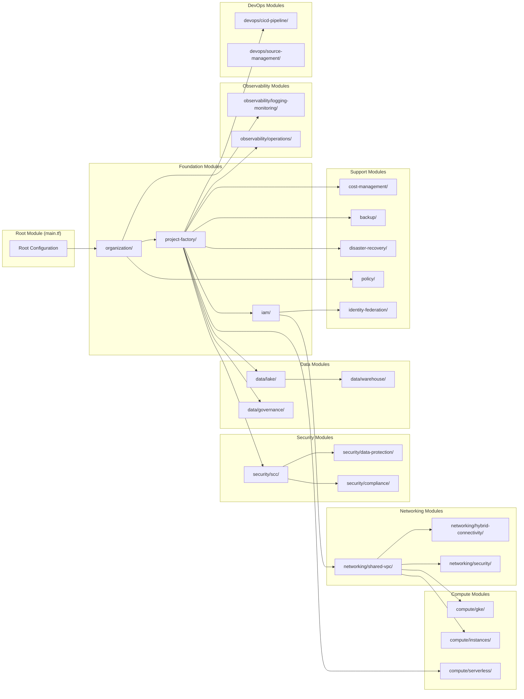
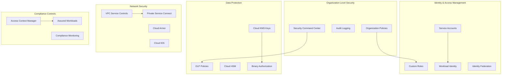
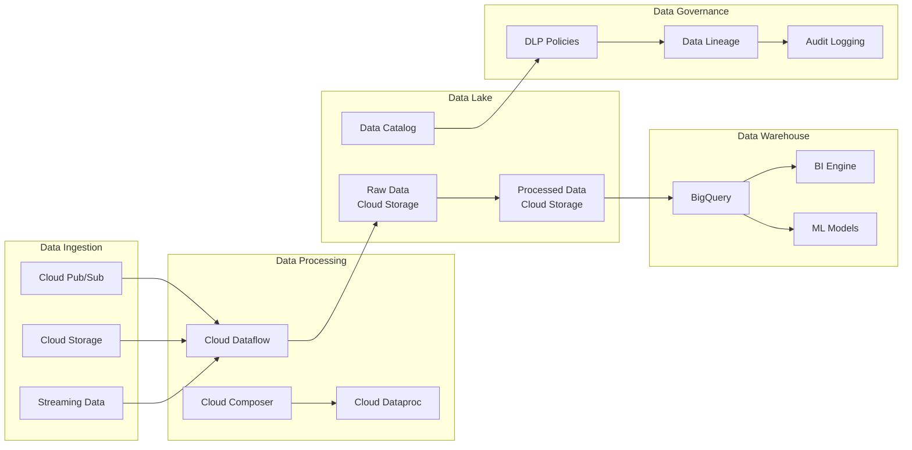
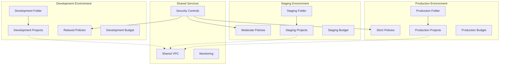

# GCP Landing Zone - Architecture Diagram

## High-Level Architecture Overview

```mermaid
graph TB
    subgraph "GCP Organization"
        ORG[Organization<br/>example.com]
        
        subgraph "Folder Hierarchy"
            DEV_FOLDER[Development Folder]
            STG_FOLDER[Staging Folder]
            PROD_FOLDER[Production Folder]
        end
        
        ORG --> DEV_FOLDER
        ORG --> STG_FOLDER
        ORG --> PROD_FOLDER
    end
    
    subgraph "Management Layer"
        MGMT_PROJECT[Management Project<br/>company-mgmt-{env}]
        ORG_POLICIES[Organization Policies]
        AUDIT_LOGS[Audit Logging]
        BILLING[Billing Export]
    end
    
    subgraph "Security Layer"
        SCC[Security Command Center]
        KMS[Cloud KMS]
        IAM_FOUNDATION[IAM Foundation]
        VPC_SC[VPC Service Controls]
        COMPLIANCE[Compliance Controls]
    end
    
    subgraph "Networking Layer"
        SHARED_VPC[Shared VPC Host]
        SUBNETS[Subnets & Secondary Ranges]
        CLOUD_NAT[Cloud NAT]
        FIREWALL[Firewall Rules]
        HYBRID[Hybrid Connectivity]
    end
    
    subgraph "Compute Layer"
        GKE[GKE Clusters]
        INSTANCES[Compute Instances]
        SERVERLESS[Cloud Run/Functions]
    end
    
    subgraph "Data Layer"
        DATA_LAKE[Data Lake<br/>Storage + Dataflow]
        DATA_WAREHOUSE[BigQuery Warehouse]
        DATA_GOV[Data Governance<br/>Catalog + DLP]
    end
    
    subgraph "Observability Layer"
        LOGGING[Cloud Logging]
        MONITORING[Cloud Monitoring]
        OPERATIONS[Cloud Operations]
    end
    
    subgraph "DevOps Layer"
        CICD[CI/CD Pipelines]
        POLICY_CODE[Policy as Code]
        BACKUP[Backup Strategy]
        DR[Disaster Recovery]
    end
    
    %% Connections
    ORG --> MGMT_PROJECT
    MGMT_PROJECT --> SCC
    MGMT_PROJECT --> AUDIT_LOGS
    SHARED_VPC --> GKE
    SHARED_VPC --> INSTANCES
    SHARED_VPC --> SERVERLESS
    SCC --> COMPLIANCE
    IAM_FOUNDATION --> GKE
    DATA_LAKE --> DATA_WAREHOUSE
    DATA_GOV --> DATA_LAKE
    LOGGING --> MONITORING
    CICD --> POLICY_CODE
    
    %% Styling
    classDef orgLevel fill:#e1f5fe
    classDef mgmtLevel fill:#f3e5f5
    classDef secLevel fill:#ffebee
    classDef netLevel fill:#e8f5e8
    classDef compLevel fill:#fff3e0
    classDef dataLevel fill:#f1f8e9
    classDef obsLevel fill:#fce4ec
    classDef devopsLevel fill:#e0f2f1
    
    class ORG,DEV_FOLDER,STG_FOLDER,PROD_FOLDER orgLevel
    class MGMT_PROJECT,ORG_POLICIES,AUDIT_LOGS,BILLING mgmtLevel
    class SCC,KMS,IAM_FOUNDATION,VPC_SC,COMPLIANCE secLevel
    class SHARED_VPC,SUBNETS,CLOUD_NAT,FIREWALL,HYBRID netLevel
    class GKE,INSTANCES,SERVERLESS compLevel
    class DATA_LAKE,DATA_WAREHOUSE,DATA_GOV dataLevel
    class LOGGING,MONITORING,OPERATIONS obsLevel
    class CICD,POLICY_CODE,BACKUP,DR devopsLevel
```

## Detailed Module Architecture



## Network Architecture Detail

```mermaid
graph TB
    subgraph "Shared VPC Host Project"
        VPC[VPC Network<br/>company-{env}-shared-vpc]
        
        subgraph "Subnets"
            MAIN_SUBNET[Main Subnet<br/>10.0.0.0/24]
            GKE_PODS[GKE Pods<br/>10.1.0.0/16]
            GKE_SERVICES[GKE Services<br/>10.2.0.0/20]
        end
        
        subgraph "Network Services"
            CLOUD_NAT_SVC[Cloud NAT]
            CLOUD_ROUTER[Cloud Router]
            FIREWALL_RULES[Firewall Rules]
        end
        
        subgraph "Security Services"
            CLOUD_ARMOR[Cloud Armor]
            CLOUD_IDS[Cloud IDS]
            VPC_FLOW_LOGS[VPC Flow Logs]
        end
        
        subgraph "Hybrid Connectivity"
            VPN_GATEWAY[VPN Gateway]
            INTERCONNECT[Cloud Interconnect]
        end
    end
    
    subgraph "Service Projects"
        DEV_PROJ[Development Projects]
        STG_PROJ[Staging Projects]
        PROD_PROJ[Production Projects]
    end
    
    VPC --> MAIN_SUBNET
    MAIN_SUBNET --> GKE_PODS
    MAIN_SUBNET --> GKE_SERVICES
    VPC --> CLOUD_NAT_SVC
    VPC --> FIREWALL_RULES
    VPC --> CLOUD_ARMOR
    VPC --> VPN_GATEWAY
    VPC --> INTERCONNECT
    
    VPC -.-> DEV_PROJ
    VPC -.-> STG_PROJ
    VPC -.-> PROD_PROJ
```

## Security Architecture Detail



## Data Architecture Detail



## Environment Strategy



## Key Architecture Principles

1. **Hub-and-Spoke Design**: Centralized shared services with distributed workloads
2. **Environment Isolation**: Clear separation between dev/staging/production
3. **Security by Default**: Zero-trust architecture with least privilege access
4. **Scalable Foundation**: Support for 1000+ projects and workloads
5. **Compliance Ready**: Built-in controls for SOC2, ISO27001, PCI-DSS
6. **Cost Optimized**: Resource tagging, budgets, and quota management
7. **Automated Operations**: Infrastructure as Code with CI/CD pipelines
8. **Disaster Recovery**: Multi-region backup and failover capabilities

## Module Dependencies

The architecture follows a strict dependency hierarchy:
1. **Foundation**: Organization → Project Factory → IAM
2. **Networking**: Shared VPC → Hybrid Connectivity → Security
3. **Compute**: Networking → GKE/Instances/Serverless
4. **Data**: Projects → Lake → Warehouse → Governance
5. **Security**: Projects → SCC → Data Protection → Compliance
6. **Operations**: Foundation → Logging → Monitoring → Operations