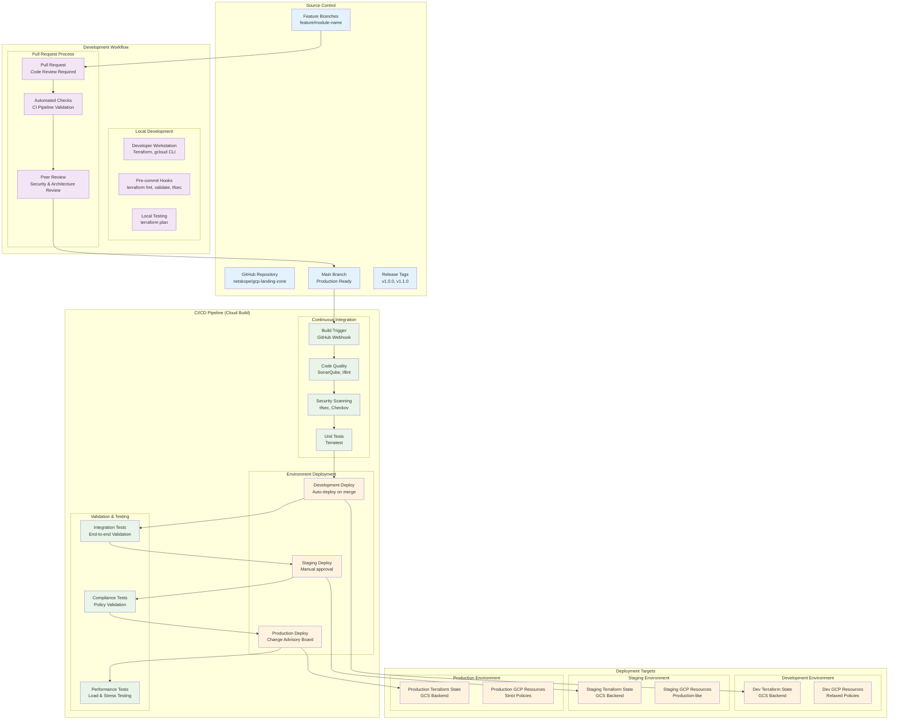
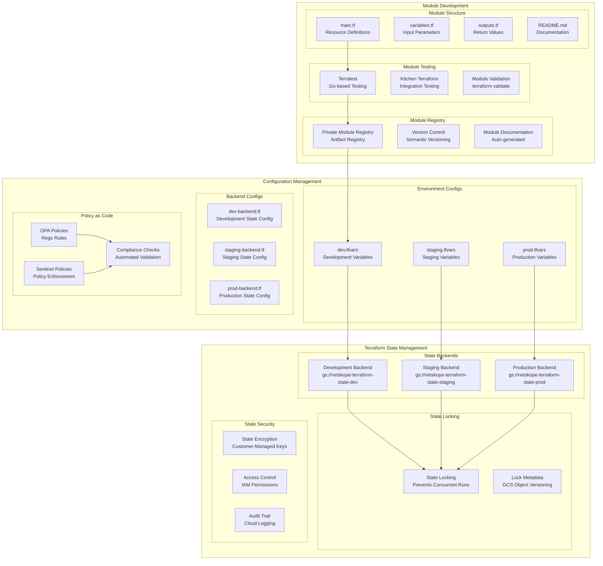
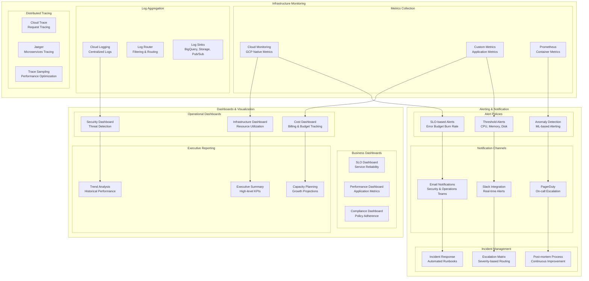
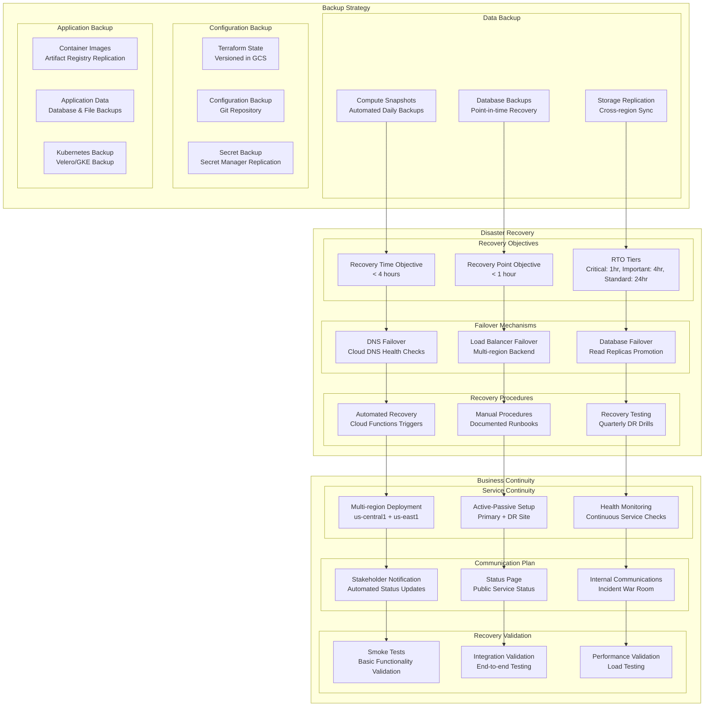
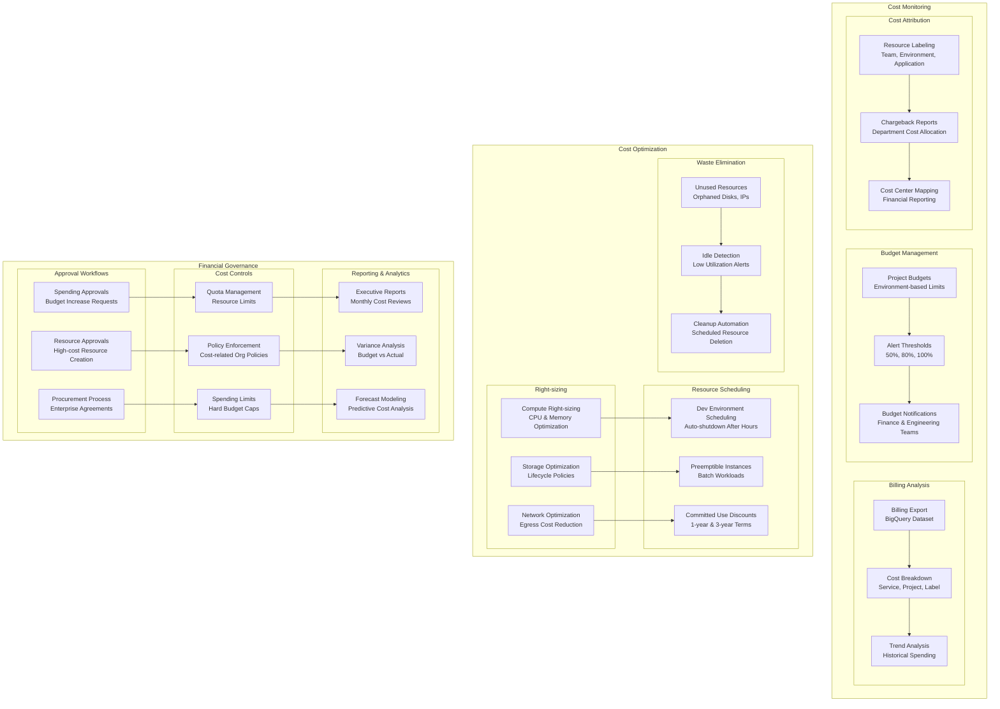

# GCP Landing Zone - Deployment & Operations Architecture

## CI/CD Pipeline Architecture

## Infrastructure as Code Workflow

## Monitoring & Observability Architecture

## Disaster Recovery & Business Continuity

## Cost Management & Optimization

## Key Operational Principles

1. **Infrastructure as Code**: All infrastructure defined in version-controlled code
2. **GitOps Workflow**: Git-based deployment and configuration management
3. **Automated Testing**: Comprehensive testing at every stage
4. **Progressive Deployment**: Dev → Staging → Production pipeline
5. **Continuous Monitoring**: Real-time visibility into all systems
6. **Proactive Alerting**: Early warning systems for issues
7. **Disaster Recovery**: Automated backup and recovery procedures
8. **Cost Optimization**: Continuous cost monitoring and optimization
9. **Security Integration**: Security checks embedded in CI/CD
10. **Compliance Automation**: Automated compliance validation and reporting