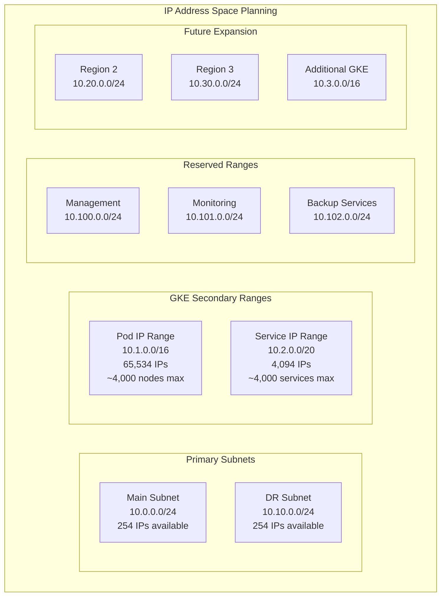
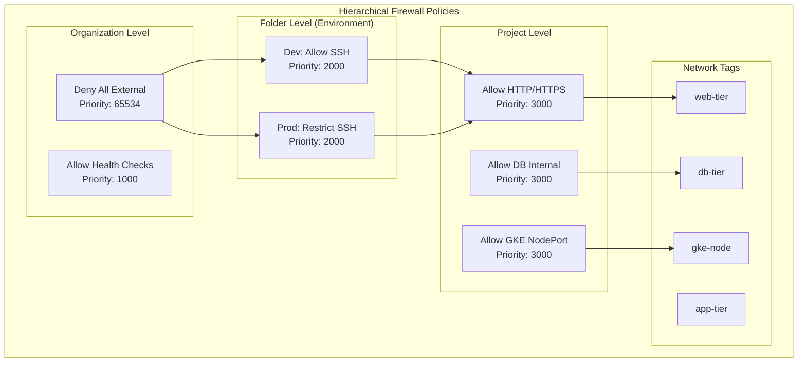
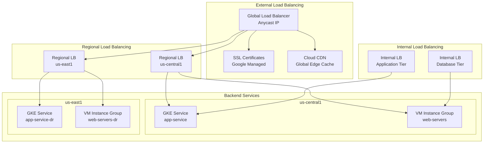
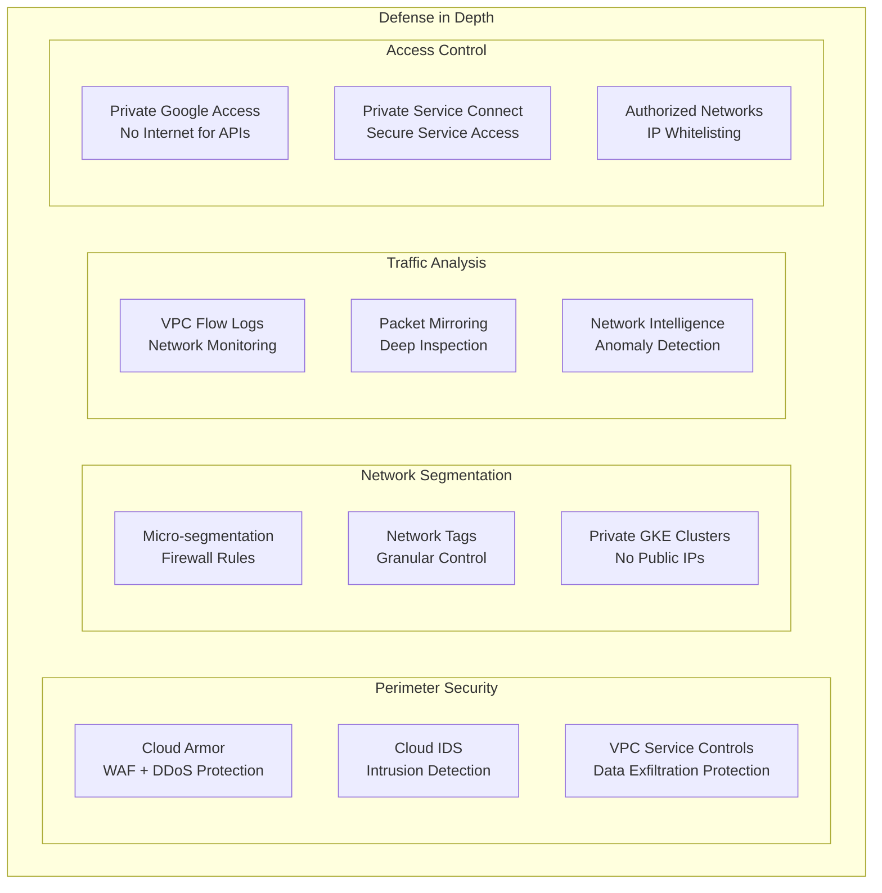
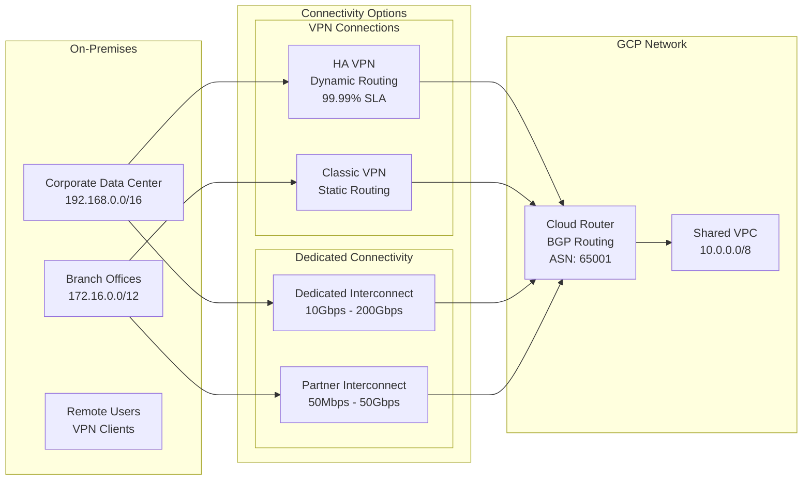

# GCP Landing Zone - Network Topology Diagram

## Network Architecture Overview

```mermaid
graph TB
    subgraph "On-Premises Network"
        ONPREM[On-Premises<br/>192.168.0.0/16]
        ONPREM_ROUTER[Corporate Router]
    end
    
    subgraph "GCP Organization - Shared VPC Architecture"
        subgraph "Host Project: netskope-network-{env}"
            VPC_HOST[Shared VPC Host<br/>netskope-{env}-shared-vpc]
            
            subgraph "us-central1 Region"
                SUBNET_MAIN[Main Subnet<br/>10.0.0.0/24<br/>us-central1]
                
                subgraph "Secondary IP Ranges"
                    GKE_PODS_RANGE[GKE Pods<br/>10.1.0.0/16<br/>gke-pods]
                    GKE_SVC_RANGE[GKE Services<br/>10.2.0.0/20<br/>gke-services]
                end
            end
            
            subgraph "us-east1 Region (DR)"
                SUBNET_DR[DR Subnet<br/>10.10.0.0/24<br/>us-east1]
            end
            
            subgraph "Network Services"
                CLOUD_ROUTER[Cloud Router<br/>ASN: 65001]
                CLOUD_NAT[Cloud NAT<br/>External IP Pool]
                VPN_GATEWAY[VPN Gateway<br/>35.x.x.x]
                INTERCONNECT_ATTACH[Interconnect Attachment<br/>Dedicated/Partner]
            end
            
            subgraph "Security Controls"
                FIREWALL_POLICIES[Hierarchical Firewall Policies]
                CLOUD_ARMOR_POLICY[Cloud Armor Policies]
                VPC_SC_PERIMETER[VPC Service Controls Perimeter]
            end
        end
        
        subgraph "Service Projects"
            subgraph "Development Environment"
                DEV_PROJ1[netskope-app-dev-001]
                DEV_PROJ2[netskope-data-dev-001]
                DEV_GKE[GKE Cluster<br/>dev-cluster]
            end
            
            subgraph "Staging Environment"
                STG_PROJ1[netskope-app-stg-001]
                STG_PROJ2[netskope-data-stg-001]
                STG_GKE[GKE Cluster<br/>staging-cluster]
            end
            
            subgraph "Production Environment"
                PROD_PROJ1[netskope-app-prd-001]
                PROD_PROJ2[netskope-data-prd-001]
                PROD_GKE[GKE Cluster<br/>prod-cluster]
            end
        end
    end
    
    subgraph "External Connectivity"
        INTERNET[Internet<br/>0.0.0.0/0]
        GOOGLE_APIS[Google APIs<br/>Private Google Access]
        PEERED_NETWORKS[Peered Networks<br/>Partner/Customer VPCs]
    end
    
    %% Connections
    ONPREM_ROUTER -.->|VPN Tunnel<br/>IPSec| VPN_GATEWAY
    ONPREM_ROUTER -.->|Dedicated Interconnect<br/>10Gbps| INTERCONNECT_ATTACH
    
    VPC_HOST --> SUBNET_MAIN
    VPC_HOST --> SUBNET_DR
    SUBNET_MAIN --> GKE_PODS_RANGE
    SUBNET_MAIN --> GKE_SVC_RANGE
    
    CLOUD_ROUTER --> VPN_GATEWAY
    CLOUD_ROUTER --> INTERCONNECT_ATTACH
    SUBNET_MAIN --> CLOUD_NAT
    
    VPC_HOST -.->|Shared VPC Attachment| DEV_PROJ1
    VPC_HOST -.->|Shared VPC Attachment| DEV_PROJ2
    VPC_HOST -.->|Shared VPC Attachment| STG_PROJ1
    VPC_HOST -.->|Shared VPC Attachment| STG_PROJ2
    VPC_HOST -.->|Shared VPC Attachment| PROD_PROJ1
    VPC_HOST -.->|Shared VPC Attachment| PROD_PROJ2
    
    DEV_GKE --> GKE_PODS_RANGE
    STG_GKE --> GKE_PODS_RANGE
    PROD_GKE --> GKE_PODS_RANGE
    
    CLOUD_NAT --> INTERNET
    SUBNET_MAIN -.->|Private Google Access| GOOGLE_APIS
    VPC_HOST -.->|VPC Peering| PEERED_NETWORKS
    
    %% Security Controls
    FIREWALL_POLICIES --> VPC_HOST
    CLOUD_ARMOR_POLICY --> VPC_HOST
    VPC_SC_PERIMETER --> VPC_HOST
    
    %% Styling
    classDef onprem fill:#ffebcd
    classDef vpc fill:#e1f5fe
    classDef subnet fill:#e8f5e8
    classDef service fill:#fff3e0
    classDef security fill:#ffebee
    classDef external fill:#f3e5f5
    
    class ONPREM,ONPREM_ROUTER onprem
    class VPC_HOST,CLOUD_ROUTER,CLOUD_NAT,VPN_GATEWAY,INTERCONNECT_ATTACH vpc
    class SUBNET_MAIN,SUBNET_DR,GKE_PODS_RANGE,GKE_SVC_RANGE subnet
    class DEV_PROJ1,DEV_PROJ2,STG_PROJ1,STG_PROJ2,PROD_PROJ1,PROD_PROJ2,DEV_GKE,STG_GKE,PROD_GKE service
    class FIREWALL_POLICIES,CLOUD_ARMOR_POLICY,VPC_SC_PERIMETER security
    class INTERNET,GOOGLE_APIS,PEERED_NETWORKS external
```

## Detailed IP Address Allocation



## Firewall Rules Architecture



## Load Balancer Architecture



## Network Security Controls



## Hybrid Connectivity Details



## Key Network Design Principles

1. **Hub-and-Spoke**: Centralized shared VPC with service project attachments
2. **Private by Default**: No public IPs for compute resources
3. **Hierarchical Security**: Organization → Folder → Project level controls
4. **Scalable IP Planning**: /16 ranges for future growth
5. **Multi-Region**: Primary (us-central1) + DR (us-east1)
6. **Zero Trust**: Micro-segmentation with network tags
7. **Hybrid Ready**: VPN and Interconnect for on-premises connectivity
8. **Monitoring**: Comprehensive flow logs and packet analysis