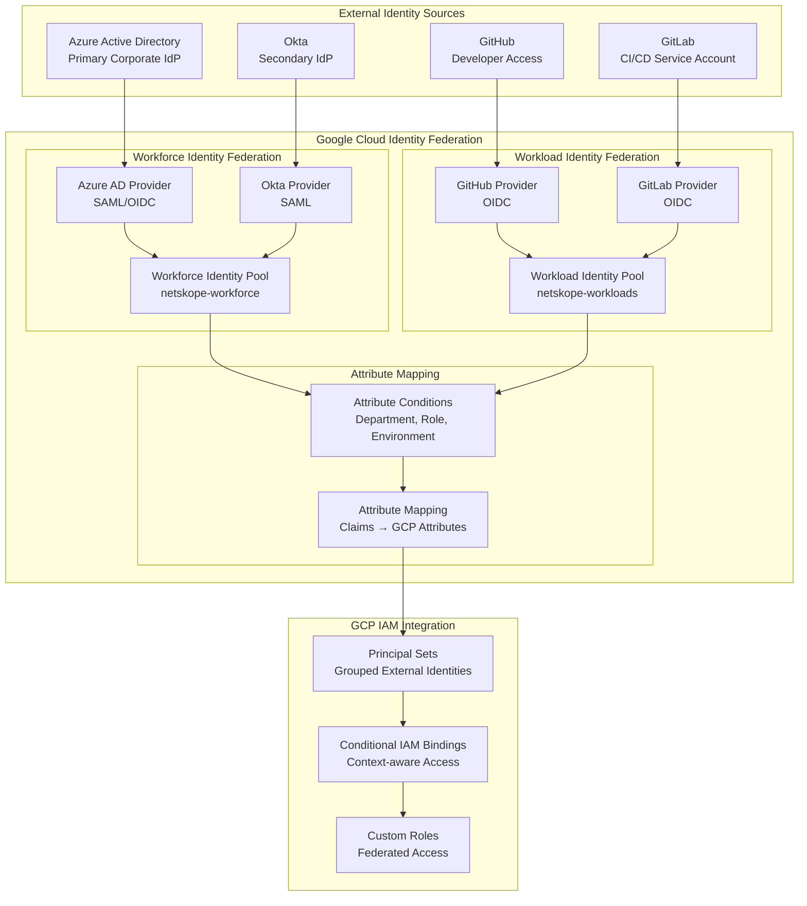
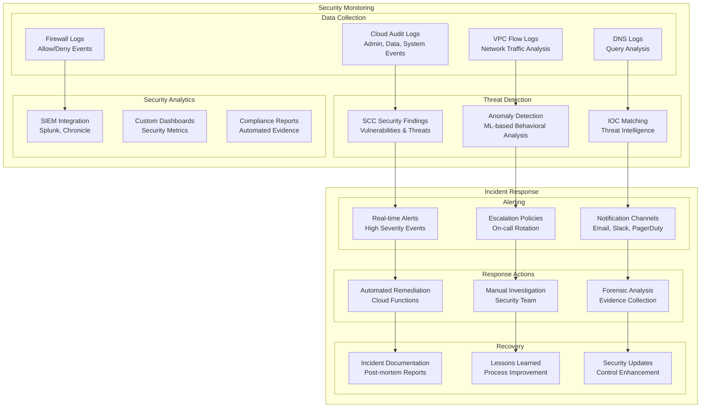

# GCP Landing Zone - Security Architecture Diagram

## Comprehensive Security Architecture

```mermaid
graph TB
    subgraph "Identity & Access Management Layer"
        subgraph "External Identity"
            CORP_AD[Corporate Active Directory]
            SAML_IDP[SAML Identity Provider]
            OIDC_PROVIDER[OIDC Provider]
        end
        
        subgraph "Google Cloud Identity"
            CLOUD_IDENTITY[Cloud Identity<br/>netskope.com]
            WORKFORCE_POOLS[Workforce Identity Pools]
            WORKLOAD_POOLS[Workload Identity Pools]
        end
        
        subgraph "IAM Foundation"
            CUSTOM_ROLES[Custom Roles<br/>Least Privilege]
            SERVICE_ACCOUNTS[Service Accounts<br/>Workload Identity]
            IAM_BINDINGS[IAM Policy Bindings<br/>Conditional Access]
        end
    end
    
    subgraph "Organization Security Controls"
        subgraph "Organization Policies"
            COMPUTE_POLICIES[Compute Policies<br/>VM External IP, OS Login]
            STORAGE_POLICIES[Storage Policies<br/>Bucket Location, Public Access]
            IAM_POLICIES[IAM Policies<br/>Domain Restriction, Service Account Keys]
        end
        
        subgraph "Security Command Center"
            SCC_PREMIUM[SCC Premium Tier<br/>Advanced Threat Detection]
            SECURITY_FINDINGS[Security Findings<br/>Vulnerabilities & Misconfigurations]
            COMPLIANCE_DASHBOARD[Compliance Dashboard<br/>CIS, PCI-DSS, NIST]
        end
    end
    
    subgraph "Data Protection Layer"
        subgraph "Encryption"
            KMS_KEYS[Cloud KMS<br/>Customer Managed Keys]
            HSM_KEYS[Cloud HSM<br/>Hardware Security Module]
            ENVELOPE_ENCRYPTION[Envelope Encryption<br/>Data Encryption Keys]
        end
        
        subgraph "Data Loss Prevention"
            DLP_POLICIES[DLP Policies<br/>PII, PHI, Financial Data]
            DLP_SCANNING[DLP Scanning<br/>Storage, BigQuery, Dataflow]
            DLP_ACTIONS[DLP Actions<br/>Quarantine, Redact, Alert]
        end
        
        subgraph "Data Governance"
            DATA_CATALOG[Data Catalog<br/>Asset Discovery]
            DATA_LINEAGE[Data Lineage<br/>Impact Analysis]
            POLICY_TAGS[Policy Tags<br/>Column-level Security]
        end
    end
    
    subgraph "Network Security Layer"
        subgraph "Perimeter Defense"
            CLOUD_ARMOR[Cloud Armor<br/>WAF + DDoS Protection]
            CLOUD_IDS[Cloud IDS<br/>Network Intrusion Detection]
            VPC_SC[VPC Service Controls<br/>Data Exfiltration Prevention]
        end
        
        subgraph "Network Segmentation"
            HIERARCHICAL_FW[Hierarchical Firewall<br/>Organization → Project]
            NETWORK_TAGS[Network Tags<br/>Micro-segmentation]
            PRIVATE_CLUSTERS[Private GKE Clusters<br/>No Public Node IPs]
        end
        
        subgraph "Traffic Analysis"
            VPC_FLOW_LOGS[VPC Flow Logs<br/>Network Monitoring]
            PACKET_MIRRORING[Packet Mirroring<br/>Deep Packet Inspection]
            NETWORK_INTELLIGENCE[Network Intelligence<br/>Anomaly Detection]
        end
    end
    
    subgraph "Application Security Layer"
        subgraph "Container Security"
            BINARY_AUTH[Binary Authorization<br/>Container Image Attestation]
            CONTAINER_ANALYSIS[Container Analysis<br/>Vulnerability Scanning]
            GKE_SECURITY[GKE Security<br/>Pod Security Standards]
        end
        
        subgraph "Runtime Security"
            SECURITY_SCANNER[Security Scanner<br/>Web App Vulnerability]
            ERROR_REPORTING[Error Reporting<br/>Security Exception Monitoring]
            CLOUD_PROFILER[Cloud Profiler<br/>Performance Security]
        end
    end
    
    subgraph "Compliance & Governance"
        subgraph "Compliance Frameworks"
            SOC2[SOC 2 Type II<br/>Security Controls]
            ISO27001[ISO 27001<br/>Information Security]
            PCI_DSS[PCI DSS<br/>Payment Card Security]
            GDPR[GDPR<br/>Data Privacy]
        end
        
        subgraph "Assured Workloads"
            ASSURED_WORKLOADS[Assured Workloads<br/>Compliance Automation]
            COMPLIANCE_MONITORING[Compliance Monitoring<br/>Continuous Assessment]
            AUDIT_REPORTS[Audit Reports<br/>Evidence Collection]
        end
    end
    
    %% Identity Flow
    CORP_AD --> WORKFORCE_POOLS
    SAML_IDP --> WORKFORCE_POOLS
    OIDC_PROVIDER --> WORKLOAD_POOLS
    WORKFORCE_POOLS --> CUSTOM_ROLES
    WORKLOAD_POOLS --> SERVICE_ACCOUNTS
    
    %% Security Controls Flow
    SCC_PREMIUM --> SECURITY_FINDINGS
    SECURITY_FINDINGS --> COMPLIANCE_DASHBOARD
    
    %% Data Protection Flow
    KMS_KEYS --> ENVELOPE_ENCRYPTION
    HSM_KEYS --> ENVELOPE_ENCRYPTION
    DLP_POLICIES --> DLP_SCANNING
    DLP_SCANNING --> DLP_ACTIONS
    
    %% Network Security Flow
    CLOUD_ARMOR --> CLOUD_IDS
    VPC_SC --> HIERARCHICAL_FW
    VPC_FLOW_LOGS --> NETWORK_INTELLIGENCE
    
    %% Application Security Flow
    BINARY_AUTH --> CONTAINER_ANALYSIS
    CONTAINER_ANALYSIS --> GKE_SECURITY
    
    %% Compliance Flow
    ASSURED_WORKLOADS --> COMPLIANCE_MONITORING
    COMPLIANCE_MONITORING --> AUDIT_REPORTS
    
    %% Styling
    classDef identity fill:#e3f2fd
    classDef orgSec fill:#fff3e0
    classDef dataProt fill:#e8f5e8
    classDef netSec fill:#ffebee
    classDef appSec fill:#f3e5f5
    classDef compliance fill:#fce4ec
    
    class CORP_AD,SAML_IDP,OIDC_PROVIDER,CLOUD_IDENTITY,WORKFORCE_POOLS,WORKLOAD_POOLS,CUSTOM_ROLES,SERVICE_ACCOUNTS,IAM_BINDINGS identity
    class COMPUTE_POLICIES,STORAGE_POLICIES,IAM_POLICIES,SCC_PREMIUM,SECURITY_FINDINGS,COMPLIANCE_DASHBOARD orgSec
    class KMS_KEYS,HSM_KEYS,ENVELOPE_ENCRYPTION,DLP_POLICIES,DLP_SCANNING,DLP_ACTIONS,DATA_CATALOG,DATA_LINEAGE,POLICY_TAGS dataProt
    class CLOUD_ARMOR,CLOUD_IDS,VPC_SC,HIERARCHICAL_FW,NETWORK_TAGS,PRIVATE_CLUSTERS,VPC_FLOW_LOGS,PACKET_MIRRORING,NETWORK_INTELLIGENCE netSec
    class BINARY_AUTH,CONTAINER_ANALYSIS,GKE_SECURITY,SECURITY_SCANNER,ERROR_REPORTING,CLOUD_PROFILER appSec
    class SOC2,ISO27001,PCI_DSS,GDPR,ASSURED_WORKLOADS,COMPLIANCE_MONITORING,AUDIT_REPORTS compliance
```

## Identity Federation Architecture

## Data Classification & Protection

```mermaid
graph TB
    subgraph "Data Classification"
        subgraph "Sensitivity Levels"
            PUBLIC_DATA[Public<br/>Marketing Materials]
            INTERNAL_DATA[Internal<br/>Business Documents]
            CONFIDENTIAL_DATA[Confidential<br/>Customer Data]
            RESTRICTED_DATA[Restricted<br/>PII, PHI, Financial]
        end
        
        subgraph "Data Types"
            STRUCTURED[Structured Data<br/>BigQuery, Cloud SQL]
            UNSTRUCTURED[Unstructured Data<br/>Cloud Storage, Documents]
            STREAMING[Streaming Data<br/>Pub/Sub, Dataflow]
        end
    end
    
    subgraph "Protection Controls"
        subgraph "Encryption at Rest"
            GOOGLE_MANAGED[Google-Managed Keys<br/>Default Encryption]
            CUSTOMER_MANAGED[Customer-Managed Keys<br/>Cloud KMS]
            CUSTOMER_SUPPLIED[Customer-Supplied Keys<br/>CSEK]
        end
        
        subgraph "Encryption in Transit"
            TLS_ENCRYPTION[TLS 1.3<br/>All Communications]
            PRIVATE_CONNECTIVITY[Private Connectivity<br/>No Internet Transit]
            VPN_ENCRYPTION[VPN Encryption<br/>Hybrid Connectivity]
        end
        
        subgraph "Access Controls"
            COLUMN_LEVEL[Column-Level Security<br/>BigQuery Policy Tags]
            ROW_LEVEL[Row-Level Security<br/>BigQuery RLS]
            OBJECT_LEVEL[Object-Level ACLs<br/>Cloud Storage]
        end
    end
    
    subgraph "DLP Implementation"
        subgraph "Detection"
            BUILT_IN_DETECTORS[Built-in Detectors<br/>SSN, Credit Card, Email]
            CUSTOM_DETECTORS[Custom Detectors<br/>Employee ID, Customer ID]
            ML_DETECTORS[ML Detectors<br/>Document Classification]
        end
        
        subgraph "Actions"
            REDACTION[Data Redaction<br/>Mask Sensitive Fields]
            QUARANTINE[Data Quarantine<br/>Isolate Violations]
            ALERTING[Real-time Alerting<br/>Security Team Notification]
        end
    end
    
    %% Data Flow
    RESTRICTED_DATA --> CUSTOMER_MANAGED
    CONFIDENTIAL_DATA --> CUSTOMER_MANAGED
    INTERNAL_DATA --> GOOGLE_MANAGED
    PUBLIC_DATA --> GOOGLE_MANAGED
    
    STRUCTURED --> COLUMN_LEVEL
    UNSTRUCTURED --> OBJECT_LEVEL
    STREAMING --> TLS_ENCRYPTION
    
    BUILT_IN_DETECTORS --> REDACTION
    CUSTOM_DETECTORS --> QUARANTINE
    ML_DETECTORS --> ALERTING
```

## Security Monitoring & Response

## Compliance Framework Implementation

```mermaid
graph TB
    subgraph "Compliance Standards"
        subgraph "SOC 2 Type II"
            SOC2_SECURITY[Security<br/>Access Controls, Encryption]
            SOC2_AVAILABILITY[Availability<br/>Monitoring, Incident Response]
            SOC2_CONFIDENTIALITY[Confidentiality<br/>Data Protection, DLP]
        end
        
        subgraph "ISO 27001"
            ISO_ISMS[ISMS<br/>Information Security Management]
            ISO_RISK[Risk Management<br/>Assessment & Treatment]
            ISO_CONTROLS[Security Controls<br/>Technical & Administrative]
        end
        
        subgraph "PCI DSS"
            PCI_NETWORK[Network Security<br/>Firewall, Segmentation]
            PCI_DATA[Data Protection<br/>Encryption, Tokenization]
            PCI_ACCESS[Access Control<br/>Authentication, Authorization]
        end
    end
    
    subgraph "Implementation Controls"
        subgraph "Technical Controls"
            ENCRYPTION_CONTROLS[Encryption Controls<br/>KMS, TLS, Disk Encryption]
            ACCESS_CONTROLS[Access Controls<br/>IAM, MFA, RBAC]
            MONITORING_CONTROLS[Monitoring Controls<br/>Logging, Alerting, SIEM]
        end
        
        subgraph "Administrative Controls"
            POLICIES_PROCEDURES[Policies & Procedures<br/>Security Documentation]
            TRAINING_AWARENESS[Training & Awareness<br/>Security Education]
            INCIDENT_MANAGEMENT[Incident Management<br/>Response Procedures]
        end
        
        subgraph "Physical Controls"
            DATA_CENTER_SECURITY[Data Center Security<br/>Google Cloud Physical Security]
            ENVIRONMENTAL_CONTROLS[Environmental Controls<br/>Power, Cooling, Fire Suppression]
        end
    end
    
    subgraph "Continuous Compliance"
        subgraph "Assessment"
            VULNERABILITY_SCANNING[Vulnerability Scanning<br/>Automated Security Assessment]
            PENETRATION_TESTING[Penetration Testing<br/>Third-party Security Testing]
            COMPLIANCE_AUDITS[Compliance Audits<br/>Internal & External Audits]
        end
        
        subgraph "Reporting"
            COMPLIANCE_DASHBOARD_COMP[Compliance Dashboard<br/>Real-time Status]
            AUDIT_EVIDENCE[Audit Evidence<br/>Automated Collection]
            ATTESTATION_REPORTS[Attestation Reports<br/>Compliance Certification]
        end
    end
    
    %% Compliance Flow
    SOC2_SECURITY --> ENCRYPTION_CONTROLS
    SOC2_AVAILABILITY --> MONITORING_CONTROLS
    SOC2_CONFIDENTIALITY --> ACCESS_CONTROLS
    
    ISO_ISMS --> POLICIES_PROCEDURES
    ISO_RISK --> VULNERABILITY_SCANNING
    ISO_CONTROLS --> TECHNICAL_CONTROLS
    
    PCI_NETWORK --> MONITORING_CONTROLS
    PCI_DATA --> ENCRYPTION_CONTROLS
    PCI_ACCESS --> ACCESS_CONTROLS
    
    VULNERABILITY_SCANNING --> COMPLIANCE_DASHBOARD_COMP
    PENETRATION_TESTING --> AUDIT_EVIDENCE
    COMPLIANCE_AUDITS --> ATTESTATION_REPORTS
```

## Key Security Principles

1. **Zero Trust Architecture**: Never trust, always verify
2. **Defense in Depth**: Multiple layers of security controls
3. **Least Privilege Access**: Minimal required permissions
4. **Continuous Monitoring**: Real-time security visibility
5. **Automated Response**: Rapid threat mitigation
6. **Compliance by Design**: Built-in regulatory controls
7. **Data-Centric Security**: Protect data wherever it resides
8. **Identity-First Security**: Strong authentication and authorization